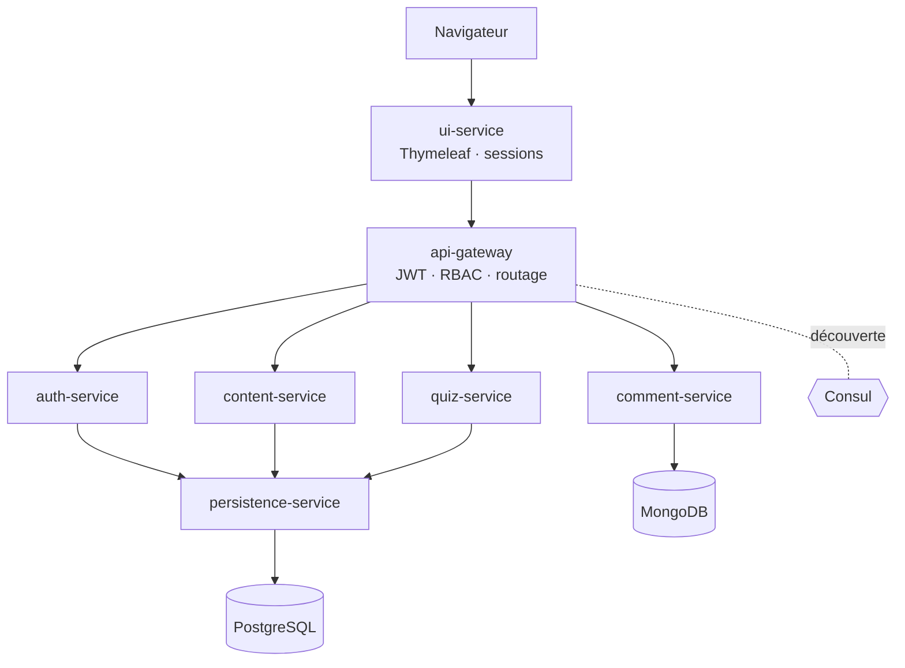
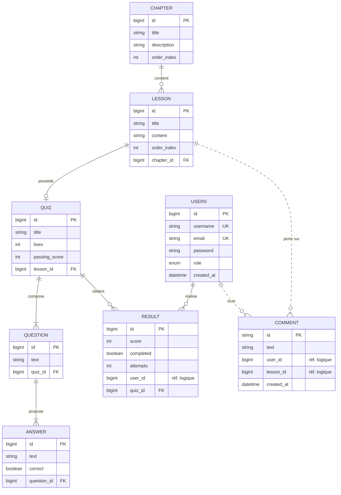

# PopJav

> Plateforme d'apprentissage du langage **Java**, construite en **microservices Spring Boot**.
> Chapitres, leçons et quiz s'enchaînent pour transformer la théorie en pratique, avec un suivi de progression.


Projet réalisé dans le cadre du titre professionnel **DWWM** (Développeur Web et Web Mobile).

---

## Sommaire

- [Fonctionnalités](#fonctionnalités)
- [Architecture](#architecture)
- [Stack technique](#stack-technique)
- [Modèle de données](#modèle-de-données)
- [Prérequis](#prérequis)
- [Démarrage](#démarrage)
- [Configuration](#configuration)
- [Routes de l'API](#routes-de-lapi)
- [Sécurité](#sécurité)
- [Tests et couverture](#tests-et-couverture)
- [Structure du projet](#structure-du-projet)
- [Roadmap](#roadmap)
- [Auteur](#auteur)

---

## Fonctionnalités

- 📚 **Contenu pédagogique** : chapitres → leçons, catalogue consultable publiquement.
- 📝 **Quiz interactifs** : système de vies, score, seuil de réussite, correction côté serveur.
- 👤 **Comptes & rôles** : inscription / connexion, rôles `USER` / `ADMIN`.
- 💬 **Commentaires** sur les leçons (stockés dans MongoDB).
- 📊 **Suivi de progression** depuis le profil utilisateur.
- 🛠️ **Back-office admin** : gestion des chapitres, leçons, quiz, questions, réponses.
- ♿ **Interface responsive et accessible** (RGAA : labels, focus, ARIA, contrastes).

---

## Architecture

Application découpée en **7 microservices** Spring Boot, avec service discovery (Consul),
passerelle unique (Spring Cloud Gateway) et communication interne via OpenFeign.



| Service | Rôle |
|---|---|
| `api-gateway` | Point d'entrée unique, validation JWT, contrôle d'accès par rôle (RBAC). |
| `auth-service` | Inscription / connexion, hachage BCrypt, émission des JWT. |
| `content-service` | Façade des chapitres et leçons. |
| `quiz-service` | Quiz, questions, réponses, correction et calcul des résultats. |
| `comment-service` | Commentaires (MongoDB). |
| `persistence-service` | Accès aux données relationnelles (source de vérité PostgreSQL). |
| `ui-service` | Interface web (Thymeleaf) consommant l'API via la gateway. |

---

## Stack technique

| Domaine | Technologies |
|---|---|
| **Langage / build** | Java 17, Maven (wrapper), Lombok |
| **Framework** | Spring Boot 3.2.1, Spring Cloud 2023.0.0 |
| **Microservices** | Spring Cloud Gateway, Consul Discovery, OpenFeign, HashiCorp Consul 1.21.3, Actuator |
| **Sécurité** | Spring Security, JWT (jjwt 0.11.5), BCrypt |
| **Persistance** | Spring Data JPA / Hibernate, PostgreSQL 16, Spring Data MongoDB, MongoDB 7, Bean Validation |
| **Front-end** | Thymeleaf, Tailwind CSS, CSS custom, JavaScript vanilla, Google Fonts |
| **Tests / qualité** | JUnit 5, Mockito, Spring Security Test, JaCoCo 0.8.11 |
| **DevOps** | Docker, Docker Compose, Git / GitHub |

---

## Modèle de données

**PostgreSQL** héberge le domaine pédagogique ; **MongoDB** héberge les commentaires
(*persistance polyglotte*). Les références inter-services (`RESULT.user_id`,
`COMMENT.user_id/lesson_id`) sont **logiques** (sans clé étrangère), pour garder les
contextes faiblement couplés.



---

## Prérequis

- **JDK 17**
- **Maven 3.9+** (ou le wrapper `./mvnw` fourni)
- **Docker** + **Docker Compose**

---

## Démarrage

### 1. Configuration

```bash
cp .env.example .env
```
Renseigne au minimum `JWT_SECRET` (voir la commande dans `.env.example`) et les mots de
passe des bases.

### 2. Infrastructure (PostgreSQL, MongoDB, Consul)

```bash
docker compose up -d
```
> Interface Consul : http://localhost:8500

### 3. Lancement des services

Dans un terminal par service (ou via l'IDE), **`persistence-service` en premier** :

```bash
cd persistence-service && ./mvnw spring-boot:run
cd auth-service        && ./mvnw spring-boot:run
cd content-service     && ./mvnw spring-boot:run
cd quiz-service        && ./mvnw spring-boot:run
cd comment-service     && ./mvnw spring-boot:run
cd api-gateway         && ./mvnw spring-boot:run
cd ui-service          && ./mvnw spring-boot:run
```

### 4. Accès

Interface web : **http://localhost:8085** (`UI_SERVICE_PORT`).

---

## Configuration

Toute la configuration sensible est externalisée dans `.env` (non versionné). Voir
`.env.example` pour la liste complète : ports des services, identifiants PostgreSQL /
MongoDB, hôte Consul, secret et durée de vie des JWT.

---

## Routes de l'API

| Préfixe | Service | Authentification |
|---|---|---|
| `/auth/**` | auth-service | Public |
| `/api/chapters/summary` | content-service | **Public** (catalogue) |
| `/api/chapters/**`, `/api/lessons/**` | content-service | JWT |
| `/api/quizzes/**`, `/api/questions/**`, `/api/answers/**`, `/api/results/**` | quiz-service | JWT |
| `/api/comments/**` | comment-service | JWT |
| `/api/users/**` | persistence-service | JWT |

Règles RBAC (appliquées à la gateway) :
- **Écritures de contenu** (`POST`/`PUT`/`DELETE` sur chapters, lessons, quizzes, questions, answers) → **ADMIN**.
- **Actions utilisateur** (soumettre un quiz, poster un commentaire, enregistrer un résultat) → ouvertes.
- Liste des utilisateurs, suppression de compte, endpoint interne `/api/users/credentials` → **ADMIN**.

---

## Sécurité

- Mots de passe hachés avec **BCrypt**, jamais renvoyés au client (`UserResponseDTO`).
- Authentification **JWT** (HS256), validée de façon centralisée à l'API Gateway.
- **RBAC** par rôle pour les opérations sensibles.
- **Anti-usurpation (IDOR)** : la gateway extrait l'identité du JWT et l'injecte en
  en-tête de confiance (`X-User-Id`) ; les identifiants fournis par le client sont ignorés.
- Message de connexion **générique** (anti-énumération de comptes).
- Réponses de quiz **masquées** côté client (le flag `correct` n'est jamais exposé).
- Secrets externalisés (`.env` non versionné).

---

## Tests et couverture

Tests unitaires (JUnit 5 + Mockito) sur la logique métier critique — `AuthService`
(inscription / connexion) et `QuizService` (calcul de score). Couverture mesurée par **JaCoCo**.

```bash
cd auth-service && ./mvnw clean test
# rapport : target/site/jacoco/index.html
```

---

## Structure du projet

```
PopJav/
├── api-gateway/          # Passerelle (routage, JWT, RBAC)
├── auth-service/         # Authentification, JWT
├── content-service/      # Chapitres, leçons
├── quiz-service/         # Quiz, questions, réponses, résultats
├── comment-service/      # Commentaires (MongoDB)
├── persistence-service/  # Accès aux données (PostgreSQL)
├── ui-service/           # Front Thymeleaf
├── docker-compose.yml    # Infrastructure (postgres, mongo, consul)
└── .env.example          # Modèle de configuration
```

---

## Roadmap

- [ ] **Conteneurisation complète** : un `Dockerfile` par microservice et orchestration
      de l'ensemble (services + infra) via `docker-compose`.
- [ ] Commentaires de code en anglais sur l'ensemble du projet.
- [ ] Enrichissement de la couverture de tests aux autres services.

---

## Auteur

**Enzo Gavini** — projet de certification DWWM.
