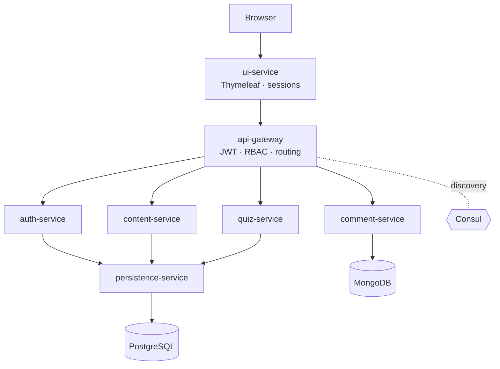
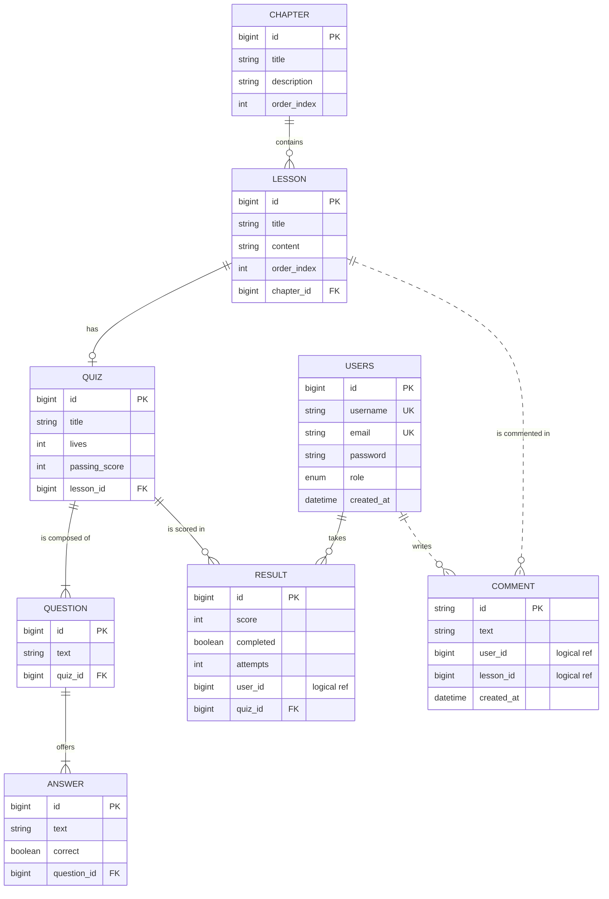

# PopJav

> A **Java** learning platform built as **Spring Boot microservices**.
> Chapters, lessons and quizzes turn theory into practice, with progress tracking.


Project built for the French **DWWM** professional certification (Web and Mobile Web Developer).

---

## Table of contents

- [Features](#features)
- [Architecture](#architecture)
- [Tech stack](#tech-stack)
- [Data model](#data-model)
- [Prerequisites](#prerequisites)
- [Getting started](#getting-started)
- [Configuration](#configuration)
- [API routes](#api-routes)
- [Security](#security)
- [Tests and coverage](#tests-and-coverage)
- [Project structure](#project-structure)
- [Roadmap](#roadmap)
- [Author](#author)

---

## Features

- 📚 **Learning content**: chapters → lessons, with a publicly browsable catalog.
- 📝 **Interactive quizzes**: lives system, scoring, passing threshold, server-side grading.
- 👤 **Accounts & roles**: sign-up / login, `USER` / `ADMIN` roles.
- 💬 **Comments** on lessons (stored in MongoDB).
- 📊 **Progress tracking** from the user profile.
- 🛠️ **Admin back-office**: manage chapters, lessons, quizzes, questions and answers.
- ♿ **Responsive and accessible UI** (labels, keyboard focus, ARIA, color contrast).

---

## Architecture

The application is split into **7 Spring Boot microservices**, with service discovery
(Consul), a single entry point (Spring Cloud Gateway) and internal calls over OpenFeign.



| Service | Responsibility |
|---|---|
| `api-gateway` | Single entry point, JWT validation, role-based access control (RBAC). |
| `auth-service` | Sign-up / login, BCrypt hashing, JWT issuance. |
| `content-service` | Facade for chapters and lessons. |
| `quiz-service` | Quizzes, questions, answers, grading and result computation. |
| `comment-service` | Comments (MongoDB). |
| `persistence-service` | Relational data access (PostgreSQL source of truth). |
| `ui-service` | Web UI (Thymeleaf) consuming the API through the gateway. |

---

## Tech stack

| Area | Technologies |
|---|---|
| **Language / build** | Java 17, Maven (wrapper), Lombok |
| **Framework** | Spring Boot 3.2.1, Spring Cloud 2023.0.0 |
| **Microservices** | Spring Cloud Gateway, Consul Discovery, OpenFeign, HashiCorp Consul 1.21.3, Actuator |
| **Security** | Spring Security, JWT (jjwt 0.11.5), BCrypt |
| **Persistence** | Spring Data JPA / Hibernate, PostgreSQL 16, Spring Data MongoDB, MongoDB 7, Bean Validation |
| **Front-end** | Thymeleaf, Tailwind CSS, custom CSS, vanilla JavaScript, Google Fonts |
| **Tests / quality** | JUnit 5, Mockito, Spring Security Test, JaCoCo 0.8.11 |
| **DevOps** | Docker, Docker Compose, Jib (image build), Docker Hub, Git / GitHub |

---

## Data model

**PostgreSQL** holds the learning domain; **MongoDB** holds the comments
(*polyglot persistence*). Cross-service references (`RESULT.user_id`,
`COMMENT.user_id/lesson_id`) are **logical** (no foreign key), to keep the bounded
contexts loosely coupled.



---

## Prerequisites

- **JDK 17**
- **Maven 3.9+** (or the bundled `./mvnw` wrapper)
- **Docker** + **Docker Compose**

---

## Getting started

### 1. Configuration

```bash
cp .env.example .env
```
Fill in at least `JWT_SECRET` (see the command in `.env.example`) and the database passwords.

### 2. Start the whole stack

The service images are published on Docker Hub. `docker compose` pulls them and starts
the infrastructure (PostgreSQL, MongoDB, Consul) **and** the 7 microservices:

```bash
docker compose pull
docker compose up -d
```
> Give the services ~30–60 s to register with Consul on first start.

### 3. Access

- Web UI: **http://localhost:8085**
- API gateway: http://localhost:8080
- Consul UI: http://localhost:8500

### Running from source (development)

Alternatively, start only the infrastructure and run each service from your IDE
(**`persistence-service` first**):

```bash
docker compose up -d postgres mongo consul
cd persistence-service && ./mvnw spring-boot:run
# ...then auth, content, quiz, comment, api-gateway, ui-service
```

---

## Configuration

All sensitive configuration is externalized in `.env` (not versioned). See
`.env.example` for the full list: service ports, PostgreSQL / MongoDB credentials,
Consul host, JWT secret and lifetime.

---

## API routes

| Prefix | Service | Authentication |
|---|---|---|
| `/auth/**` | auth-service | Public |
| `/api/chapters/summary` | content-service | **Public** (catalog) |
| `/api/chapters/**`, `/api/lessons/**` | content-service | JWT |
| `/api/quizzes/**`, `/api/questions/**`, `/api/answers/**`, `/api/results/**` | quiz-service | JWT |
| `/api/comments/**` | comment-service | JWT |
| `/api/users/**` | persistence-service | JWT |

RBAC rules (enforced at the gateway):
- **Content writes** (`POST`/`PUT`/`DELETE` on chapters, lessons, quizzes, questions, answers) → **ADMIN**.
- **User actions** (submitting a quiz, posting a comment, saving a result) → open.
- User listing, account deletion, internal `/api/users/credentials` endpoint → **ADMIN**.

---

## Security

- Passwords hashed with **BCrypt**, never returned to the client (`UserResponseDTO`).
- **JWT** authentication (HS256), validated centrally at the API gateway.
- **RBAC** by role for sensitive operations.
- **IDOR protection**: the gateway extracts the identity from the JWT and injects it as a
  trusted header (`X-User-Id`); client-supplied identifiers are ignored.
- **Generic login error** message (prevents account enumeration).
- Quiz answers **hidden** from the client (the `correct` flag is never exposed).
- Secrets externalized (`.env`, not versioned).

---

## Tests and coverage

Unit tests (JUnit 5 + Mockito) on the core business logic — `AuthService`
(sign-up / login) and `QuizService` (score computation). Coverage measured with **JaCoCo**.

```bash
cd auth-service && ./mvnw clean test
# report: target/site/jacoco/index.html
```

---

## Project structure

```
PopJav/
├── api-gateway/          # Gateway (routing, JWT, RBAC)
├── auth-service/         # Authentication, JWT
├── content-service/      # Chapters, lessons
├── quiz-service/         # Quizzes, questions, answers, results
├── comment-service/      # Comments (MongoDB)
├── persistence-service/  # Data access (PostgreSQL)
├── ui-service/           # Thymeleaf front-end
├── docker-compose.yml    # Full stack (infra + 7 services)
└── .env.example          # Configuration template
```

---

## Roadmap

- [x] **Full containerization**: images built with Jib and published to Docker Hub,
      full-stack orchestration (services + infra) via `docker-compose`.
- [ ] English code comments across the whole project.
- [ ] Extend test coverage to the remaining services.

---

## Author

**Enzo Gavini** — DWWM certification project.
